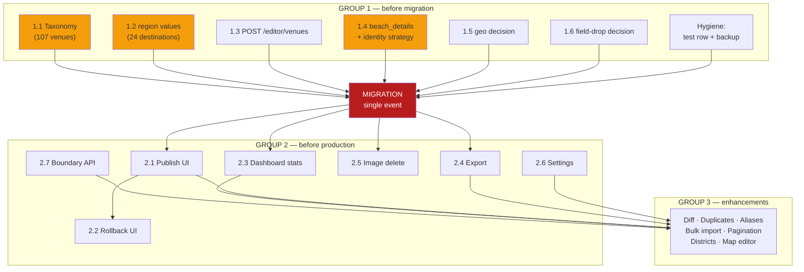

# Feature Parity Implementation Plan

**Type:** Architecture planning document. No code, schema, migrations, or SQL.
**Source:** [`docs/SCHEMA_GAP_AUDIT.md`](SCHEMA_GAP_AUDIT.md)
**Date:** 2026-07-28
**Objective:** Reach feature parity *before* importing legacy data, in the
order that minimises technical debt and guarantees the migration runs **once**.

---

## The organising principle

Every item below is placed by answering one question:

> **If we do this *after* the import, what does it cost?**

That yields three cost classes, and they map directly onto the group
boundaries:

| Cost class | Meaning | Group |
|---|---|---|
| **One-way door** | The source data is discarded at import; doing this later means the information no longer exists to recover | **1** |
| **Re-touch** | Doing this later requires re-running the import, backfilling rows, or a second migration event | **1** |
| **Additive** | Doing this later touches only code/UI, never migrated rows | **2 / 3** |

Group 1 is therefore **not** "the important work" — it is specifically the
work that becomes *impossible or expensive* once 426 venues exist in the
database. Several Group 2 items are more visible to users and more urgent
commercially; they are still safe to do later, which is exactly why they are
sequenced later.

**Legacy DataLab is being retired.** The `production_dataset_v18.json` export
is the last copy of anything not carried across. That fact is what makes the
one-way-door category real rather than theoretical.

---

## GROUP 1 — Must be completed before migration

Six items. Together they are the entire blocking set.

### 1.1 Venue taxonomy mismatch — 107 blocked venues

**Why it exists.** `VENUE_CATEGORIES` was fixed at nine values from a product
brief and a review of the source's *"63 raw category strings,"* on the
recorded reasoning that the mess was *"almost entirely at the subtype level."*
DataLab has since curated those strings into a clean 11-value taxonomy in
which `Activity` (38), `Spa` (28), `Beach Club` (21) and `Resort` (20) are
**peer concepts, not subtypes** of anything in the nine.

**Risk if ignored.** 25.1% of the catalogue cannot be imported at all — the
`CHECK` constraint rejects the rows. Force-mapping instead destroys a real
editorial distinction **irreversibly**, because the source category is not
retained anywhere in the target schema. This is the single hardest one-way
door in the plan.

**Complexity: S.** One constant, one migration, one docs update. The cost is
the *decision*, not the code.

| Backend | Database | API | UI | Migration |
|---|---|---|---|---|
| `VENUE_CATEGORIES` constant | `ck_venues_category` CHECK rebuild | Category filter values widen | Category dropdown gains 4 options | **Unblocks 107 venues** |

**Recommendation:** extend to 13 values. Still far below the 15–20 threshold
`docs/DATABASE.md` itself names as the trigger for promoting `category` to a
lookup table. Also settle the two near-certain renames explicitly rather than
by assumption: `Café`→`Cafe` (52), `Service`→`Services` (20).

---

### 1.2 `destinations.region` strategy — 24 values

**Why it exists.** `region` is `NOT NULL` by deliberate design (*"required,
5 known values today"*). The export carries `null` for all 25 destinations.

**Risk if ignored.** No destination can be created; the FK target for all 426
venues never exists. Total migration failure at step one.

**Complexity: S** (data entry) — but **only 6 of 25 slugs** contain a
recognisable area name, and the value *format* is unknown (the one production
example is `"Sidi Abdelrahman Area"`). Inferring the other 18 from developer
brand names (`salt`, `gaia`, `koun`, `june`) would be inventing data.

| Backend | Database | API | UI | Migration |
|---|---|---|---|---|
| None | None (values only) | None | None | **Unblocks all 25 destinations** |

**Recommendation:** supply the 24 values manually. Do not relax the column to
nullable — that trades a five-minute data task for a permanent weakening of a
documented invariant.

---

### 1.3 Venue creation path — no `POST /editor/venues` exists

**Why it exists.** The API has no venue-create endpoint. Venues support only
GET / PATCH / media / workflow / bulk-ops, all of which operate on rows that
already exist. This is a parity gap independent of migration: **an editor
cannot add a venue to the platform at all.**

**Risk if ignored.** The migration cannot run through the API under any
strategy, and post-migration the platform cannot grow. Every new venue would
require a database script.

**Complexity: M.** Endpoint, request schema, validation, permission wiring,
tests. The patterns already exist — `POST /editor/destinations` is the
template.

| Backend | Database | API | UI | Migration |
|---|---|---|---|---|
| New route + schema | None | **New `POST /editor/venues`** | "New Venue" form (can follow) | Enables API-based import |

**Note:** for the one-time import a direct-model script is still preferable
(single transaction, no HTTP overhead). This item is about *parity*, not about
the import mechanism — but building it first means the import can be validated
against the same validation path editors use.

---

### 1.4 Beach data write path + identity strategy

**Why it exists.** `venues.beach_details` (JSONB) was created to hold
beach-only facts, and **nothing can write to it** — not the API, not the
Studio, not any import path. Separately, the 187 beach records carry no `id`,
no `slug`, and no coordinates, and 3 reference destinations that don't exist
(`Fouka`, `Ras El Hekma`, `Sidi Abdelrahman` are regional, not destination,
names).

**Risk if ignored.** Two distinct failures. Without the write path, beaches
migrate as venues with **every beach-specific fact null** — a silent, total
loss of `type` and `publicAccess`. Without an identity strategy, they cannot
migrate at all without fabricating primary keys.

**This is the item that decides whether the migration runs once or twice.**
Deferring beaches (current policy) is safe and correct *today*, but it
guarantees a second migration event later. If a single migration is the goal,
this must land in Group 1.

**Complexity: M.** Schema addition to the venue PATCH contract, plus a
documented ID-derivation rule (e.g. slugified name scoped to destination) and
a decision on the 3 orphans.

| Backend | Database | API | UI | Migration |
|---|---|---|---|---|
| Validation for `beach_details` shape | None (column exists) | Extend venue PATCH | Beach fields in venue editor | **Enables single-event migration of 187 records** |

---

### 1.5 `venues.geo` — preserve-or-drop decision

**Why it exists.** `geo` is listed in `docs/DATABASE.md`'s *"Explicitly
excluded from the schema"* as `boundaryReviews` — a correct decision for a
*product* schema, since boundary-review state is tooling, not a fact about a
venue. But **426 venues carry `reviewed: true` with a reviewer and timestamp**,
plus a full `history[]` audit trail. That is real human work.

**Risk if ignored.** Silent, permanent loss at the moment of import. Not
recoverable afterwards — the legacy system is being retired and this export is
the last copy. The danger here is that the *decision* gets made by default
rather than deliberately.

**Complexity: S** if preserving (serialise into `internal_notes` or a nullable
`legacy_geo` JSONB); **zero** if dropping. Either is defensible; only silence
is not.

| Backend | Database | API | UI | Migration |
|---|---|---|---|---|
| Serialisation step (if preserving) | Optional `legacy_geo` JSONB | None | None | One-way door at import |

**Recommendation:** preserve as opaque JSONB, uphold the exclusion of any geo
*workflow* (that stays Group 4). Cheap insurance against a decision nobody
consciously made.

---

### 1.6 Undocumented field drops — `externalLink`, `rating`, `reviews`

**Why it exists.** These appear in neither the schema **nor** the "Explicitly
excluded" list. Unlike `geo`, they were not rejected — they appear to have
been overlooked during the rewrite.

**Risk if ignored.** Low in volume (1, 0, 0 populated records) but identical
in *class* to 1.5: a one-way door. The real risk is procedural — a field lost
twice, once by oversight and once by import.

**Complexity: XS.** Either three columns, or three lines in the exclusion
list.

| Backend | Database | API | UI | Migration |
|---|---|---|---|---|
| Trivial | 0–3 nullable columns | Optional | Optional | 1 record affected |

**Recommendation:** document as excluded. The data does not justify columns;
the omission justifies a sentence. Also fold `destinations.short_description`
(0 populated) into the same decision.

---

### Group 1 hygiene (not features, but pre-migration)

- **Remove the leftover test row** `test-dest-98e967ef` ("Should Not Be
  Public") so post-migration counts are trustworthy.
- **Take a database backup** immediately before import (`api/scripts/backup_db.sh`).

---

## GROUP 2 — Should be completed before production

None of these block the import. All are additive — they touch code and UI,
never migrated rows. Several are nonetheless **more commercially urgent** than
Group 1 items.

### 2.1 Publish UI — the core workflow is unreachable

**Why it exists.** `publish_revisions` is implemented and correct, and
`POST /editor/publish` exists — but **no human can trigger it from the
Studio.** The Publishing page's own comment concedes: *"No publish/rollback
controls live here yet."*

**Risk if ignored.** After migration, 426 venues sit in `draft` and the public
site stays empty. The platform cannot complete its own core workflow through
its own interface. **This is the highest-severity item in the entire plan
after Group 1.**

**Complexity: S.** The API is done; this is a button, a confirmation dialog,
and a mutation hook.

| Backend | Database | API | UI | Migration |
|---|---|---|---|---|
| None | None | None (exists) | **Publish control + confirm** | None |

### 2.2 Rollback / republish UI

**Why it exists.** `POST /editor/publish/revisions/{id}/republish` exists and
is unreachable, exactly as 2.1.

**Risk if ignored.** No recovery path from a bad publish without direct API
calls — during an incident, which is the worst possible time.

**Complexity: S.**

| Backend | Database | API | UI | Migration |
|---|---|---|---|---|
| None | None | None (exists) | Republish control on revision detail | None |

### 2.3 Dashboard statistics

**Why it exists.** Legacy had `stats.json` (9 aggregates) and a live
dashboard. `Dashboard.tsx` is a 13-line hardcoded welcome screen.

**Risk if ignored.** No operational visibility — no way to see catalogue size,
coverage, or workflow backlog. Post-migration, no way to eyeball whether the
import looks right.

**Complexity: M.** One aggregate endpoint plus a stat-tile page. All values
derivable from existing tables; no schema change.

| Backend | Database | API | UI | Migration |
|---|---|---|---|---|
| Aggregate queries | None | **`GET /editor/stats`** | Dashboard rebuild | None |

### 2.4 Export (CSV / JSON)

**Why it exists.** Legacy had Export CSV and Export JSON. The new platform has
**no way to get data out** — a straight regression.

**Risk if ignored.** Data is write-only. No offline analysis, no backup that
isn't a `pg_dump`, no way to hand data to a third party. Also an implicit
lock-in risk.

**Complexity: M.**

| Backend | Database | API | UI | Migration |
|---|---|---|---|---|
| Serialisers | None | **`GET /editor/venues/export`** | Export button | None |

### 2.5 Image delete

**Why it exists.** Legacy had `DELETE /covers/<path>` with folder pruning. The
new platform is upload-only.

**Risk if ignored.** Wrong or rights-expired images cannot be removed —
a genuine legal/PR exposure, not just untidiness. Storage grows monotonically.

**Complexity: S.**

| Backend | Database | API | UI | Migration |
|---|---|---|---|---|
| Storage delete | None | **`DELETE .../media`** | Remove button | None |

### 2.6 Settings page

**Why it exists.** Explicit `PagePlaceholder`.

**Risk if ignored.** Cosmetic today — there is no setting that currently needs
a home. Listed for honesty about parity, not urgency.

**Complexity: S–M** depending on scope. **Recommendation: define scope before
building.** A settings page with nothing to configure is worse than a
placeholder.

### 2.7 Boundary editing

**Why it exists.** 10 polygons import fine, but `PATCH /editor/destinations`
does not accept `boundary` — importable, not maintainable.

**Risk if ignored.** Boundaries freeze at their imported state permanently.

**Complexity: S** for API; **L** if a map editor UI is in scope (legacy had
one in v1.3.9). **Recommendation:** ship the API now, defer the map editor to
Group 3.

| Backend | Database | API | UI | Migration |
|---|---|---|---|---|
| Validation | None | Extend destination PATCH | Deferred | None |

---

## GROUP 3 — Nice improvements

| Item | Why | Risk if ignored | Complexity | Impact summary |
|---|---|---|---|---|
| **Build comparison / revision diff** | Legacy diffed two builds | Hard to answer "what changed in this publish?" | M | API + UI; no DB |
| **Duplicate detection** | Legacy had "Possible Duplicates" | Duplicates accumulate silently | M | API + UI; no DB |
| **Alias management UI** | `destinations.aliases` exists with no writer | Column stays permanently unused | S | API + UI; no DB |
| **Bulk import endpoint** | Formalises repeatable ingest | Future imports stay ad-hoc scripts | M | API; no DB |
| **Pagination controls** | API paginates; UI requests one large page | Degrades as catalogue grows | S | UI only |
| **District management** | Legacy had a districts view; now free text | Typo-driven fragmentation | S | UI + optional validation |
| **Map boundary editor** | Legacy v1.3.9 | Boundaries need GeoJSON by hand | L | UI-heavy |
| **Venue create form** | Pairs with 1.3 | Editors cannot add venues via UI | M | UI only |

*Group 3 is deliberately unordered — none of it gates anything else.*

---

## GROUP 4 — Explicitly rejected

Curation tooling belonging to DataLab, not to the production platform. All are
named in `docs/DATABASE.md`'s *"Explicitly excluded from the schema"* list.
**Rejecting these is a decision to re-affirm, not revisit.**

| Item | Rejection rationale |
|---|---|
| **Geo review workflow** (`boundaryReviews`) | Boundary-review state is tooling. The *data* is preserved as opaque JSONB per 1.5; the *workflow* is not rebuilt |
| **Merge engine, field locks, merge history** | Existed to reconcile competing import sources. The platform has one source of truth — the problem no longer exists |
| **QA flags / Data Quality Center** | Superseded by the validation gate + review workflow, which are enforced rather than advisory |
| **Workspace + backup/restore** | Superseded by `publish_revisions` (immutable, DB-enforced) plus `pg_dump` |
| **`sources`, `registry`, `venue_map`** | Import bookkeeping and dedup caches |
| **`aliases.non_aliases`** | Artefact of the merge engine's matching logic |
| **Cover sourcing status / priority / last-checked** | Production-workflow tracking, not facts about a venue |
| **`POST /api/folder/open`** | Opened a NAS file manager. Obsolete by deployment model |
| **Derived counters** (`venueCount`, `verifiedCount`, `categoryBreakdown`, `stats.json`) | Computed on read (see 2.3). Storing them invites drift — the legacy data already shows it: `seashell` claims 13 venues, actually has 10 |

---

## Dependency graph



### Reading the graph

- **Group 1 items are mutually independent** — all six can proceed in
  parallel. None depends on another. They converge only at the migration gate.
- **The migration is a hard barrier.** Nothing in Group 2 or 3 should start
  before it *for sequencing reasons*, but nothing in them is *blocked* by it
  either — they are simply lower value until real data exists.
- **2.1 → 2.2 is the only intra-Group-2 dependency** (rollback UI reuses the
  publish UI's confirmation and mutation patterns).
- **2.7 → Group 3 map editor**: the boundary API must exist before an editor
  can be built on top of it.

### Critical path

```
1.1 Taxonomy decision  ──►  MIGRATION  ──►  2.1 Publish UI  ──►  live site
```

Everything else can run alongside. **1.1 is the true critical path** — it is
the only item that is simultaneously blocking, irreversible, and a decision
rather than an implementation.

---

## Recommended milestone plan

### Milestone 1 — Schema completion & one-way-door decisions
**Contents:** 1.1, 1.2, 1.5, 1.6 + hygiene
**Exit criteria:** every field in the export has a documented destination or a
documented rejection; `VENUE_CATEGORIES` accepts all 426 venues; 24 region
values supplied; test row removed.

Deliberately decision-heavy and code-light. Nothing here is hard to *build* —
the cost is in choosing, and every choice is irreversible after Milestone 3.

### Milestone 2 — Write-path completion
**Contents:** 1.3 (venue create), 1.4 (beach write path + identity)
**Exit criteria:** every entity in the export has a working write path; a
dry-run import of all 426 venues **and** 187 beaches passes validation against
a scratch database.

Closes the "column with no writer" class of gap. The dry run is what converts
this plan from theory to evidence.

### Milestone 3 — Migration (single event)
**Contents:** backup → import venues + destinations + beaches → validation
report
**Exit criteria:** row counts reconcile; zero broken FKs; zero duplicates;
everything `draft`; `publish_revisions` still empty.

**One event, not two.** Milestones 1–2 exist specifically to make this true.

### Milestone 4 — Publishing workflow
**Contents:** 2.1, 2.2
**Exit criteria:** an editor can approve, publish, and roll back entirely
through the Studio, with no API calls.

This is what makes Milestone 3 *worth anything* — until it lands, the
migration is invisible to the public. Deliberately after migration, because it
touches no migrated rows and is easier to validate against real content.

### Milestone 5 — Operational tooling
**Contents:** 2.3, 2.4, 2.5, 2.7 (+ 2.6 once scoped)
**Exit criteria:** the platform is observable (stats), reversible (export),
and correctable (image delete, boundary edit).

### Milestone 6 — Future enhancements
**Contents:** Group 3, prioritised by demand rather than by plan.

---

## Why this order minimises technical debt

1. **The migration runs once.** Beaches are handled in Milestone 2, not
   deferred — the single largest source of "we'll migrate that later" debt is
   removed by construction.
2. **Every irreversible decision precedes the irreversible action.** All four
   one-way doors (1.1, 1.4, 1.5, 1.6) close in Milestones 1–2, before any row
   is written.
3. **No item requires re-touching migrated data.** Everything after Milestone
   3 is purely additive — new endpoints, new screens, no backfills.
4. **The critical path is a decision, not a build.** 1.1 gates everything and
   is a half-day of work behind a product judgement. Recognising that early is
   what prevents the schedule being set by the wrong thing.
5. **Rejected work stays rejected.** Group 4 is enumerated so the parity
   conversation ends, rather than resurfacing per-feature as "the old tool
   could do this."

### The one risk this ordering accepts

Between Milestones 3 and 4 the catalogue is fully migrated but **publicly
invisible** — 426 draft venues, no publish UI. If that window matters
commercially, 2.1 can move ahead of Milestone 3 at no architectural cost; it
touches no migrated data. That is a scheduling choice, and it is the only
place in this plan where the order is genuinely negotiable.
